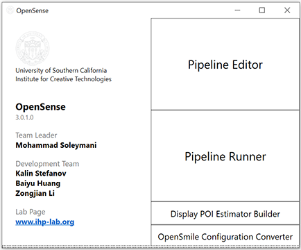
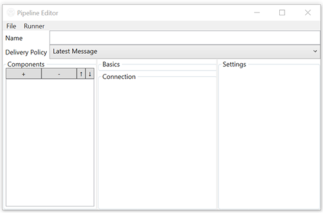
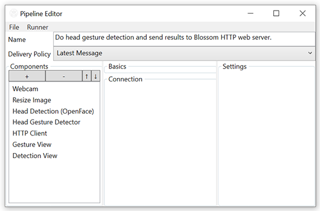
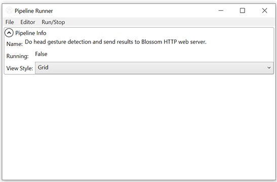
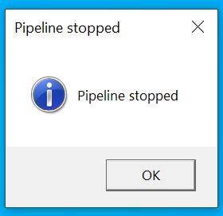

# Introduction

This guide provides steps to run [OpenSense's Windows application](https://github.com/intelligent-human-perception-laboratory/OpenSense/releases), and steps to run *pipelines* which work together with [OpenSense-Blossom Bridge](../Robot%20Server%20Codebase/README.md).

# Goals

We will run 2 pipelines.
The first pipeline will let Blossom mimicking our head gestures such as nod, tilt and shake.
And the second pipeline will let Blossom nod its head once we finish talking.

# Prerequisite Hardware and Environment Requirements

Windows operating system with arch AMD64/x64 CPU is required.
OpenSense GUI and its head detection component ([OpenFace](https://github.com/TadasBaltrusaitis/OpenFace)), relies on these environments.

A webcam is required for offline head detection.
It will be used in our first pipeline.
You can skip the first pipeline, if you do not have a webcam.

A microphone is required for voice activity detection.
It will be used in our second pipeline.
You can skip the second pipeline, if you do not have a microphone.
Usually, a standalone webcam hardware will also include a microphone.

Internet connection and some hard disk space for downloading the software is also needed.

Please run [OpenSense-Blossom Bridge](../Robot%20Server%20Codebase/README.md) (or Bridge in-short) and set it aside if you have not done it so.
However, if the Bridge is not running, the following pipelines will still run without throwing errors, because HTTP request errors are silently discarded (see its python code later).
So, it is OK to run OpenSense pipelines without the Bridge running aside.

# Software Architecture Overview

In this project we will use OpenSense to do the head detection part of the job. OpenSense is extensible and has a graphical UI that users can interact with.
It suits the needs of our OpenHMI project.

However, Blossom's official codebase is written in Python, which is different from our OpenSense's C# codebase. As a result, our software solution has 3 separate parts, OpenSense, Blossom driver and OpenSense-Blossom Bridge.

OpenSense and Blossom driver communicate by using the widely used HTTP protocol, with the help of OpenSense-Blossom Bridge (or Bridge in-short).
In detail, the Bridge opens an HTTP web server that listing for head gesture detection results (or other results). And OpenSense will do the human perception (head gesture detection and/or voice activity detection) and send results as an HTTP client. This is a single-way communication.

# Instructions of OpenSense Installment

In this instruction we use a pre-compiled version of OpenSense, so you do not need to install build tools and build it. OpenSense is open-sourced on Github, so you can build it from source code if you prefer. The build instruction is available on Github.

You can download the pre-compiled OpenSense from OpenSense's [Github Release Page](https://github.com/intelligent-human-perception-laboratory/OpenSense/releases). OpenSense and its default components are bundled in a ZIP file. Unzip it to somewhere you like for later use. OpenSense is designed to be ready to run without going through an installation process. When you do not need OpenSense and want to free some space of your disk, deleting the folder will remove OpenSense.

If you previously downloaded OpenSense and its major version number (the first digit of the version number) is not 3, please download a newer version from our release page, as an essential component was added in version 3. The version number is displayed on OpenSense's main window.

Although, OpenSense does not require a installation process, its underlying runtime (`.NET 7 runtime`) and a dependency (`Visual C++ Redistributable`) of a component (OpenFace) we will use here do require going through installment processes. To minimize OpenSense package size, They are not packaged together with OpenSense.

For Visual C++ Redistributable, you can download its VS2022 x64 installer from here ([link](https://aka.ms/vs/17/release/vc_redist.x64.exe)).
More details can be found at Microsoft's page ([link](https://learn.microsoft.com/en-us/cpp/windows/latest-supported-vc-redist?view=msvc-170)) including the aforementioned installer download link.

For .NET 7 runtime, to check whether you need to download it from Microsoft and install it. Just find and launch `OpenSense.WPF.exe` by double clicking it. If an error prompts like the one below, you do no have .NET 7 runtime installed. By clicking the `Yes` button, you will be lead to its download page. You can also download it in advance by visiting .NET download page at here ([link](https://dotnet.microsoft.com/en-us/download/dotnet/7.0)) and select `.NET Desktop Runtime 7.x.x Windows x64 Installer`. `SDK 7.x.x Windows x64 Installer` is also acceptable, though it is for .NET developers.

# Run the First Pipeline (Head Gesture Detection)

Launch OpenSense's UI by double clicking `OpenSense.WPF.exe`. It should look like the following picture.

> Sometimes, Windows will prompt you a warning window saying there are risks running this software (OpenSense WPF Application in this case). Windows gives this warning because OpenSense has a handy feature that it scans its own folder looking for components and loads them dynamically. However, in our case, all components in the ZIP bundle are written by the development team, and we did not buy a certificate from Microsoft for signing it. If you have concern about security issues, you can try to run it in a virtual machine, like Hyper-V.

Then click `Pipeline Editor`, which opens a pipeline editor window.

Open a saved pipeline file by clicking `File` then `Open` menu button.
Select `head-gesture.pipe.json` which provided in this same folder.

Before we run this pipeline, we need to select a camera for it.
Click `Webcam` on the left, then select a camera from the `Camera` drop down list on the right.

If you modified the OpenSense-Blossom Bridge, such as the port it listens to, you can select the component called `HTTP Client` and modify its python code shown on the right. There are 2 sections of python codes, the second (on the bottom) is the one having parameters can be modified.

If you want to save the previous modification, you can do so by clicking `File` then `Save as` menu button to save it to a new file.

Now, we can run our head gesture detection pipeline.
Click menu button `Runner`.
An `Pipeline Runner` window will be opened.

Click menu button `Run/Stop` then `Run` to run the pipeline.
This pipeline utilizes CPU only, and will yield higher output rate if the CPU speed/frequency is higher.

Try to nod, shake or tilt your head constantly in front of the camera.
The movement does not need to be very quick.
Pipeline Runner will show results, and Blossom should move accordingly.

To stop the pipeline, Click menu button `Run/Stop` then `Stop`, or simply close the Pipeline Runner window.
Once the pipeline reaches to a complete stop, a message box will pop out indicating the pipeline is shutdown.

# Run the Second Pipeline (Voice Activity Detection)

> This pipeline requires running OpenSense-Blossom Bridge with Debouncing disabled. Debouncing is disabled by default, unless you enabled it through its command line argument.

All the steps on OpenSense side are basically the same as those for the first pipeline.
Open a Pipeline Editor window, and load pipeline from file `voice-activity.pipe.json`.

Select the `Microphone` component on the left and set your microphone on the right. Leave other parameters of this component unchanged as they are not important in this demo.

Still, if your OpenSense-Blossom Bridge is running under a different set of parameters, you can modify the `HTTP Client` component's python code to align them.

Optionally, save the modified pipeline.

Switch to Pipeline Runner by clicking the `Runner` menu button.
Then, run the pipeline by clicking the `Run/Stop` menu button and the `Run` sub menu button.

Try to talk and pause, Blossom will nod when you

# Additional Challenge

Combine 2 pipelines together and achieve a result that, Blossom give one reaction every time the speaker stops speaking, and the reaction is determined by the last recognized head gesture while the speaker was speaking.

Here are some details/hints:
+ In the python component, define 2 input ports, give them different names, define 2 handler functions as well. The name of a port and the name of its handler function should match to each other.
+ No need to care about parallel execution related issues, the underlying Microsoft /psi ensures serial execution.
+ It is OK to ignore the necessity of aligning data timestamps from 2 inputs.
+ OpenSense-Blossom Bridge is not need to be modified. *You can if you want.*
+ Send HTTP request in only 1 of handlers.
+ Operations like copy & paste components and appending components from a file are not implemented.
